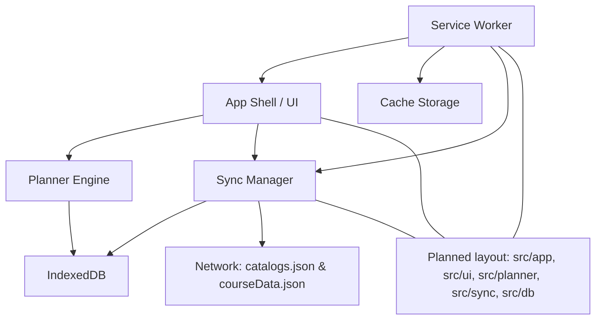
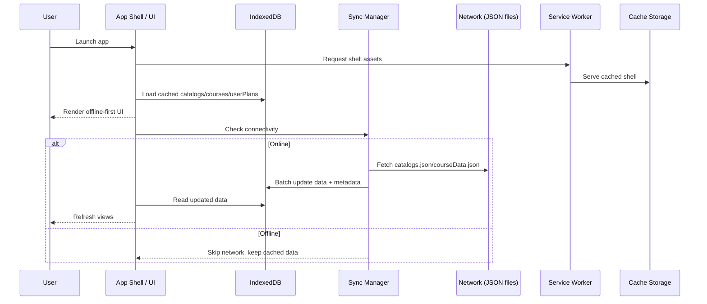

# Agent Guide: Planit

## Project goal

Planit is a degree planner for the Technion. It will be a PWA that works offline and syncs when online.

## Core data sources

- `catalogs.json`: degree programs and requirements.
- `courseData.json`: course details.

## Storage and sync

- Use IndexedDB as the local database.
- The app should operate fully offline using IndexedDB as the source of truth.
- When online, sync and refresh the local IndexedDB data from the two JSON files.
- Assume both JSON files are very large; avoid loading them repeatedly or unnecessarily.

## PWA expectations

- Offline-first behavior is required.
- Sync should happen in the background or on app start when connectivity is available.

## High-level design

- **App shell**: lightweight UI that loads from cache and renders from IndexedDB, never blocks on network.
- **Data layer**: IndexedDB stores `catalogs`, `courses`, and `userPlans` with versioned metadata and last-sync timestamps.
- **Sync flow**: on startup/online, fetch JSON files, diff by version or checksum, then update IndexedDB in batches.
- **Planner engine**: derives degree requirements and course eligibility from cached data and user plan state.
- **UI structure**: degree picker, requirement checklist, term planner grid, course search, and sync status.
- **PWA**: service worker caches shell assets, handles offline routing, and schedules background sync when available.

## Diagrams

## Notes for agents

- Favor incremental changes and avoid blocking the UI when parsing or writing large datasets.
- Keep data update paths resilient to partial failures (e.g., retry or resume logic).

## Style guide

This section defines the visual language, component patterns, and Tailwind CSS v4 rules for Planit.
It is optimized for a professional minimalist PWA with RTL and LTR support, based on the current design assets in `src/assets`.

### Goals

- Professional, minimalist, calm.
- Dark-first UI with high legibility and subtle depth.
- Support RTL and LTR layout and typography.
- Tailwind v4 utilities only; no raw CSS unless impossible with Tailwind.

### Brand and Theme

#### Visual Character

- Backgrounds are deep charcoal with soft gradients, not flat black.
- Surfaces are slightly lighter than background, with soft corners.
- Primary actions use a cool teal/mint accent.
- Typography is clean and legible with clear hierarchy.

#### Color System (Tokens)

Define theme tokens as CSS variables and map them to Tailwind v4 theme variables.
Use a small set of purposeful colors with clear semantic meaning.
The default tokens represent the light theme. Use `dark:` variants for dark theme values.

Core tokens:

- `--color-bg` (app background)
- `--color-surface-1` (primary surface)
- `--color-surface-2` (secondary surface)
- `--color-border` (subtle divider/border)
- `--color-text` (primary text)
- `--color-text-muted` (secondary text)
- `--color-accent` (primary action)
- `--color-accent-contrast` (text/icon on accent)
- `--color-success` `--color-warning` `--color-danger` `--color-info`

Each semantic token should have light defaults with `dark:` overrides.

Guidelines:

- Keep contrast at or above WCAG AA for primary text.
- Use semantic colors only for status meaning, not decoration.
- Reserve accent for primary actions and highlights.

#### Typography

Primary font must support Hebrew well. Suggested options:

- Assistant
- Heebo
- Rubik

Type scale (Tailwind sizes):

- Display: `text-2xl` to `text-3xl`, semibold
- Title: `text-xl` to `text-2xl`, semibold
- Section: `text-lg`, medium
- Body: `text-xs`, regular
- Meta: `text-xs`, regular, use secondary text color

Rules:

- Use `font-medium` for headings; avoid heavy weights.

### Spacing and Layout

- Use 4px-based spacing scale.
- Prefer `gap-*` over `space-*` utilities.
- Cards align on a soft grid; avoid hard outlines.
- Max width for content areas on desktop; full-bleed on mobile.

### Elevation and Depth

- 2-3 shadow tiers only.
- Use subtle shadow on cards and overlays.
- Avoid heavy glow or neon effects.

### Motion

- 150-250ms for most transitions.
- Use easing that feels calm and responsive (ease-out).
- Animate only what helps comprehension (panel open, hover, focus).

## Tailwind v4 Rules

This project uses Tailwind CSS v4. Follow the v4 upgrade guide:
`https://tailwindcss.com/docs/upgrade-guide`

Rules:

- Use Tailwind utilities exclusively; no raw CSS unless impossible in Tailwind.
- Keep custom utilities in Tailwind v4 format (`@utility`).
- Prefer CSS theme variables and built-in color utilities.
- Avoid deprecated v3 utilities like `shadow-sm`, `rounded-sm`, `outline-none`.
- Use `gap-*` instead of relying on `space-*` in large layouts.
- Use `@import "tailwindcss";` in CSS, not `@tailwind` directives.

When using a JS config, explicitly load it with `@config` and avoid unsupported options.

## Directionality and PWA Requirements

- Use logical start/end utilities instead of left/right.
- Use Tailwind start/end variants for spacing and positioning.
- Respect `env(safe-area-inset-*)` for PWA safe areas.

## Component Patterns

### Buttons

- Primary: accent background, high-contrast text, subtle shadow.
- Secondary: neutral surface, border, muted text.
- Tertiary: text-only, no background.

### Cards

- Rounded corners, subtle border or shadow.
- Dense layout with clear typographic hierarchy.
- Use a small colored status dot sparingly.

### Inputs and Search

- Rounded input, muted background, clear focus ring.
- Use `ring` utilities explicitly with a chosen color.
- Placeholder text is softer; do not rely on default placeholder colors.

### Tabs and Navigation

- Underline or subtle highlight for active state.
- Keep navigation concise, text-focused.

### Badges and Chips

- Small radius, low height, use semantic colors.
- Avoid bright fills unless status-critical.

### Modals and Panels

- Use overlay with slight blur or opacity.
- Keep motion subtle; avoid full-screen transitions.

## Accessibility

- Maintain AA contrast for text and interactive elements.
- Visible focus states on all interactive controls.
- Minimum 44px touch targets for PWA.
- Do not rely on color alone to convey meaning.

## Content and Tone

- Short, clear labels.
- Use consistent language for actions.
- Avoid dense paragraphs; prefer short lists or grouped blocks.

## Do / Do Not

Do:

- Use Tailwind utilities, consistent tokens, and shared patterns.
- Keep hierarchy clear and spacing generous.
- Use subtle depth and calm motion.

Do not:

- Add raw CSS for new UI unless Tailwind cannot express it.
- Introduce bright, high-saturation colors outside of status usage.
- Mix multiple visual styles across the app.

## Implementation Notes

- The existing styles are currently in `src/style.css` using Tailwind v4 import.
- All new UI should align with the assets in `src/assets`.
- If tokens are introduced, keep them centralized and referenced via Tailwind utilities.

## TypeScript conventions

- Prefer function declarations (`function foo() {}`) over const arrow assignments (`const foo = () => {}`) when possible.
