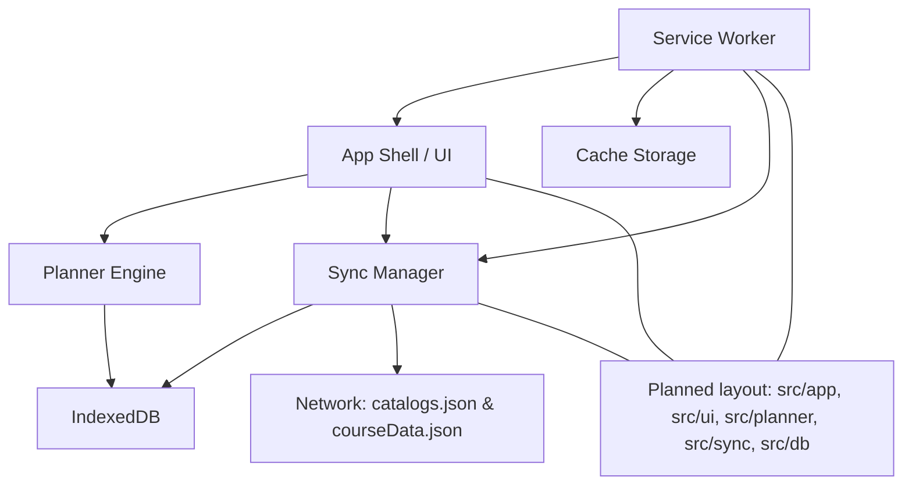
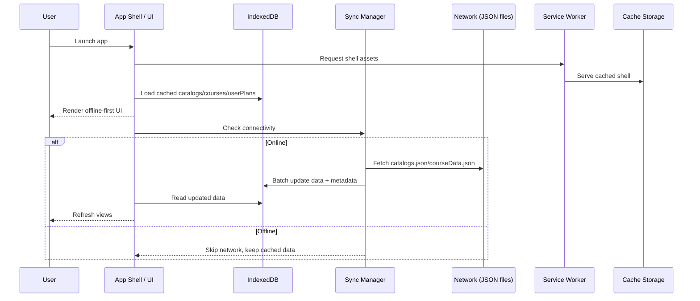

# Agent Guide: Planit

## Project goal

Planit is a degree planner for the Technion. It will be a PWA that works offline and syncs when online.

## Core data sources

- `catalogs.json`: degree programs and requirements.
- `courseData.json`: course details.

## Storage and sync

- Use IndexedDB as the local database.
- The app should operate fully offline using IndexedDB as the source of truth.
- When online, sync and refresh the local IndexedDB data from the two JSON files.
- Assume both JSON files are very large; avoid loading them repeatedly or unnecessarily.

## PWA expectations

- Offline-first behavior is required.
- Sync should happen in the background or on app start when connectivity is available.

## High-level design

- **App shell**: lightweight UI that loads from cache and renders from IndexedDB, never blocks on network.
- **Data layer**: IndexedDB stores `catalogs`, `courses`, and `userPlans` with versioned metadata and last-sync timestamps.
- **Sync flow**: on startup/online, fetch JSON files, diff by version or checksum, then update IndexedDB in batches.
- **Planner engine**: derives degree requirements and course eligibility from cached data and user plan state.
- **UI structure**: degree picker, requirement checklist, term planner grid, course search, and sync status.
- **PWA**: service worker caches shell assets, handles offline routing, and schedules background sync when available.

## Diagrams

## Notes for agents

- Favor incremental changes and avoid blocking the UI when parsing or writing large datasets.
- Keep data update paths resilient to partial failures (e.g., retry or resume logic).
