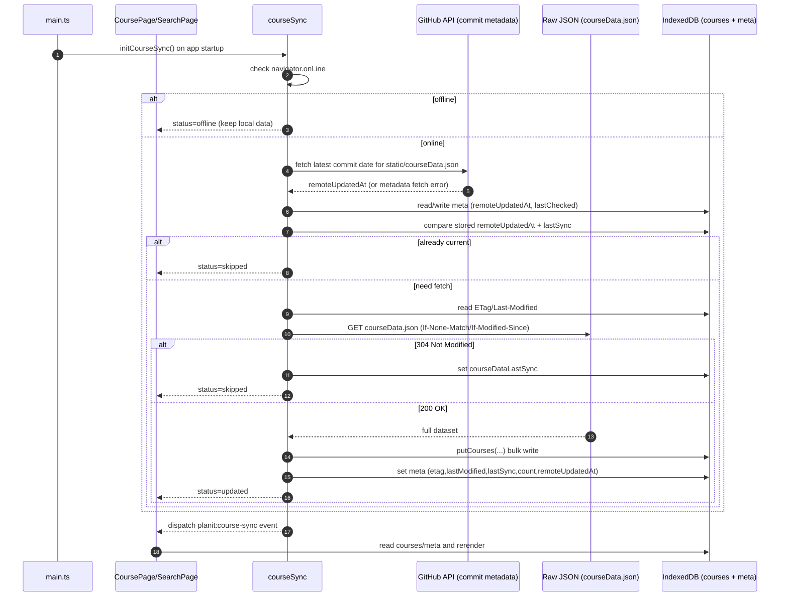
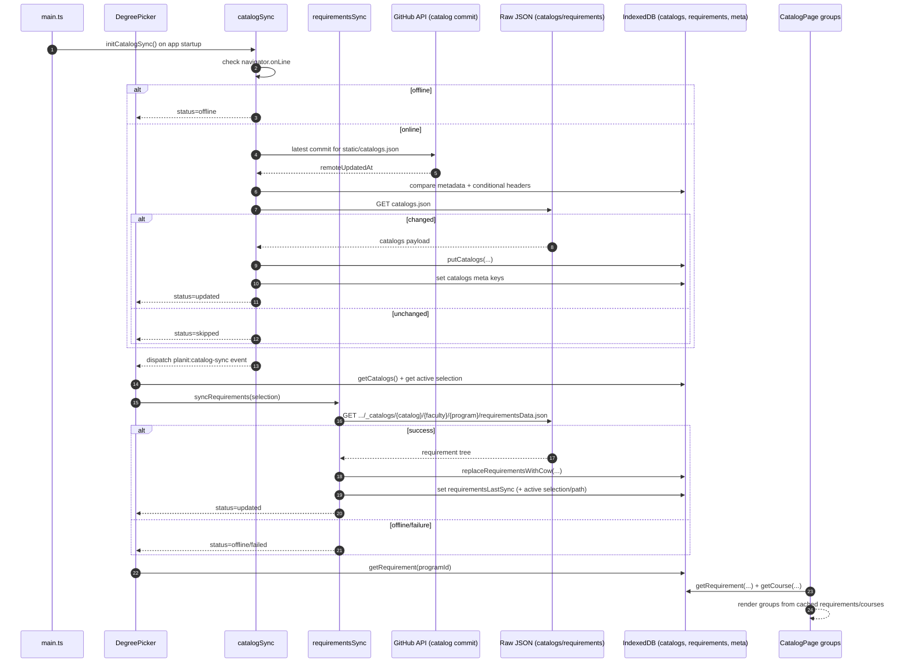
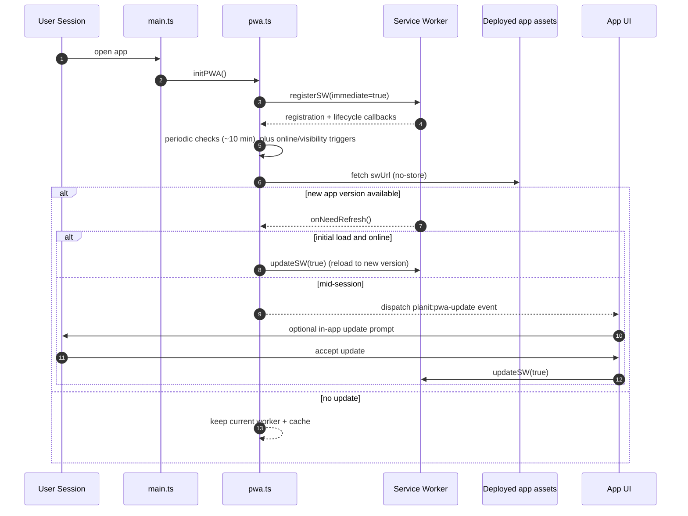
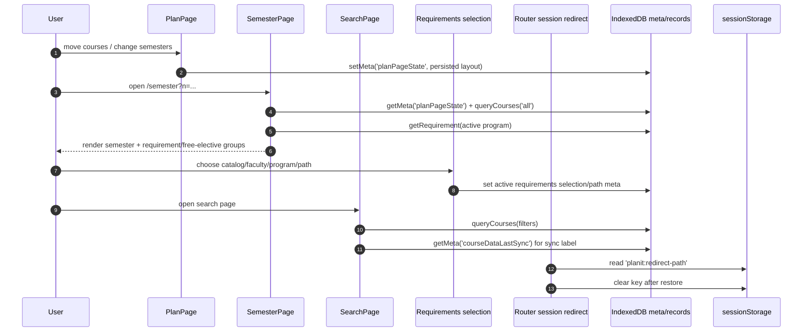

# Data Handling in Planit

This document explains how data is managed end-to-end in the app: dataset sync (`courseData.json`, `catalogs.json`), PWA code updates, and user state persistence.

## 1) Course dataset sync (`courseData.json`)

Relevant files:

- [`src/main.ts`](src/main.ts)
- [`src/lib/courseSync.ts`](src/lib/courseSync.ts)
- [`src/lib/indexeddb.ts`](src/lib/indexeddb.ts)
- [`src/pages/course/course_page.ts`](src/pages/course/course_page.ts)
- [`src/pages/search/search_page.ts`](src/pages/search/search_page.ts)

Notes:

- Sync starts from app bootstrap (`main.ts`) and runs again on `online` events.
- Views read from IndexedDB, so local data is still usable offline.

## 2) Catalog + requirements data sync (`catalogs.json` + `requirementsData.json`)

Relevant files:

- [`src/main.ts`](src/main.ts)
- [`src/lib/catalogSync.ts`](src/lib/catalogSync.ts)
- [`src/lib/requirementsSync.ts`](src/lib/requirementsSync.ts)
- [`src/lib/indexeddb.ts`](src/lib/indexeddb.ts)
- [`src/pages/catalog/components/DegreePicker.ts`](src/pages/catalog/components/DegreePicker.ts)
- [`src/pages/catalog/catalog_page.ts`](src/pages/catalog/catalog_page.ts)

Notes:

- `catalogs.json` is synced globally from `main.ts`; `requirementsData.json` is synced per selected program.
- Requirement writes use copy-on-write replacement (`replaceRequirementsWithCow`) and persist active selection when complete.

## 3) App code update flow (PWA)

Relevant files:

- [`vite.config.ts`](vite.config.ts)
- [`src/main.ts`](src/main.ts)
- [`src/lib/pwa.ts`](src/lib/pwa.ts)

Notes:

- Workbox is configured with `clientsClaim` and `skipWaiting` for fast activation.
- Update UX remains event-driven via `planit:pwa-update`; UI listeners can decide how to present the prompt.

## 4) User state management (local-first)

Relevant files:

- [`src/lib/indexeddb.ts`](src/lib/indexeddb.ts)
- [`src/pages/plan/plan_page.ts`](src/pages/plan/plan_page.ts)
- [`src/pages/semester/semester_page.ts`](src/pages/semester/semester_page.ts)
- [`src/pages/search/search_page.ts`](src/pages/search/search_page.ts)
- [`src/lib/requirementsSync.ts`](src/lib/requirementsSync.ts)
- [`src/lib/router.ts`](src/lib/router.ts)

Notes:

- Most user state is local in IndexedDB `meta` plus domain stores (`courses`, `catalogs`, `requirements`).
- Session redirect state is transient and stored in `sessionStorage` (`planit:redirect-path`).
