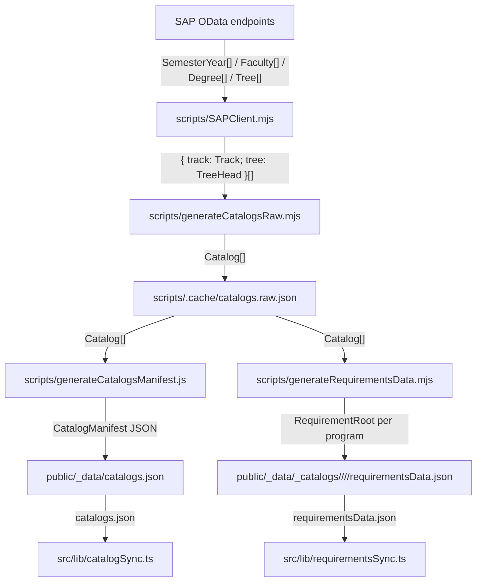

# generateCatalogs Data Flow

This document defines the catalog-generation pipeline with explicit transform
types. The current pipeline generates:

- picker manifest: `public/_data/catalogs.json`
- per-program requirements snapshots:
  `public/_data/_catalogs/**/requirementsData.json`

No requirement subtree text files (`en`, `he`, `courses`) are generated anymore.

## Type Signatures

```ts
type I18N = { he: string };

type Track = {
  Otjid: string;      // "SC..."
  Peryr: string;      // year
  Perid: string;      // semester code
  OrgId: string;      // faculty id
  Name: I18N;
  OrgText: I18N;
  ZzQualifications: I18N;
};

type Tree = {
  Otjid: string;      // "CG..." | "SM..."
  Name: I18N;         // SAP he request: usually HE, sometimes EN fallback
  courses?: string[]; // "SM........"
  children?: Tree[];
};

type Catalog = {
  track: Track;
  tree: { children?: Tree[] };
};

type RequirementNode = {
  name: string;       // Otjid
  he: string;         // display label (HE/EN fallback from SAP he request)
  courses?: string[]; // stripped course ids, e.g. "03240070"
  nested?: RequirementNode[];
};

type RequirementRoot = {
  name: 'requirement';
  he: string;         // program qualification label
  nested: RequirementNode[];
};
```

## Transform Pipeline



## Per-Step Transformations

1. `SAPClient.getTrackTrees(tracks) -> Tree[]`
2. `generateCatalogsRaw.mjs`
: `Track[] + Tree[] -> Catalog[]` written to `scripts/.cache/catalogs.raw.json`
3. `generateCatalogsManifest.js`
: `Catalog[] -> catalogs.json` (picker hierarchy only)
4. `generateRequirementsData.mjs`
: `Catalog[] -> RequirementRoot` per program path

## Normalization Rules

- Structure nodes are removed from user-facing requirements:
  - `node.he === "מבנה"` (or `"Structure Element"` fallback)
  - children are flattened into parent `nested`
- Course ids are normalized:
  - input `"SM03240070"` -> output `"03240070"`
- Output under `_catalogs` is file-only:
  - exactly one `requirementsData.json` per program directory
