# stateManagement

## Overview

This module is the single state access boundary for app pages. Pages should not
call IndexedDB or requirements-sync modules directly. They should import
`state` and use domain methods (`state.courses.*`, `state.userPlan.*`, etc.).

The implementation is provider-based:

- The app has one active provider at a time (local provider with optional
  Firestore-backed user slices when authenticated).
- Every state operation delegates to the active provider.
- Swapping provider via `state.provider.set(nextProvider)` triggers router
  rerender of the current route, so the same page can rehydrate from the new
  backend without changing page code.

This file should be treated as a context dump for future work on state.

## Current Architecture (Context Switch Notes)

- Runtime pages use global `state`; constructor DI was intentionally removed.
- Provider change notifications are internal only (`setStateProviderChangeHandler`).
- There is no public `onchange` event API yet.
- Slice `set(...)` methods may be async and should be treated as write-through
  operations for persistent slices.
- `state.provider.set(...)` is synchronous and swaps provider immediately.
- Router wires provider changes to rerender (`src/lib/router.ts`).

## Exports

- `state`
    - `state.courses.get(code)`
    - `state.courses.set(courses)`
    - `state.courses.query(params)`
    - `state.courses.page(limit, offset)`
    - `state.courses.count()`
    - `state.courses.faculties()`
    - `state.courses.getLastSync()`
    - `state.catalogs.get()`
    - `state.catalogs.set(catalogs)`
    - `state.requirements.get(programId)`
    - `state.requirements.sync(selection, options?)`
    - `state.userDegree.get()`
    - `state.userDegree.set(selection)`
- `state.userPlan.get()`
- `state.userPlan.set(value)`
- `state.firebase.login()`
- `state.firebase.logout()`
- `state.firebase.getUser()`
- `state.provider.get()`
- `state.provider.set(nextProvider)`
- `createLocalStateProvider()`
- `setStateProviderChangeHandler(handler)`
- `StateProvider` type

## Provider Contract

`StateProvider` is the stable contract for backend implementations.

- `courses`: course reads/writes and search-oriented queries.
- `catalogs`: catalogs blob read/write.
- `requirements`: requirement record read/write/sync.
- `userDegree`: active degree selection persistence.
- `userPlan`: planner state persistence (`planPageState`).
- `firebase`: auth-facing helpers for login/logout/current user lookup.

If you add a new slice, update all of these:

1. `StateProvider` type in `src/lib/stateManagement.ts`.
2. `state` delegating wrapper in `src/lib/stateManagement.ts`.
3. `createLocalStateProvider()` implementation.
4. Tests in `src/lib/stateManagement.test.ts`.
5. Story/test helpers that construct providers in pages.
6. This document.

## Local Provider Mapping

Current local provider methods map to existing modules as follows:

- `courses.get` -> `indexeddb.getCourse`
- `courses.set` -> `indexeddb.putCourses`
- `courses.query` -> `indexeddb.queryCourses`
- `courses.page` -> `indexeddb.getCoursesPage`
- `courses.count` -> `indexeddb.getCoursesCount`
- `courses.faculties` -> `indexeddb.getCourseFaculties`
- `courses.getLastSync` -> `indexeddb.getMeta('courseDataGeneratedAt')`
- `catalogs.get` -> `indexeddb.getCatalogs`
- `catalogs.set` -> `indexeddb.putCatalogs`
- `requirements.get` -> `indexeddb.getRequirement`
- `requirements.sync` -> `requirementsSync.syncRequirements`
- `userDegree.get` -> local `requirementsSync.getActiveRequirementsSelection`,
  then Firestore `users-v2/<uid>.userDegree` override when logged in
- `userDegree.set` -> `requirementsSync.setActiveRequirementsSelection` +
  Firestore `users-v2/<uid>.userDegree` mirror when logged in
- `userPlan.get` -> local `indexeddb.getMeta('planPageState')`, then Firestore
  `users-v2/<uid>.planPageState` override when logged in
- `userPlan.set` -> local `indexeddb.setMeta({ key: 'planPageState', ... })` +
  Firestore `users-v2/<uid>.planPageState` mirror when logged in
- `firebase.login` -> `firebase.login`
- `firebase.logout` -> `firebase.logout`
- `firebase.getUser` -> `firebase.getUser`

## Data Sync Ownership

- App bootstrap (`src/main.ts`) initializes global dataset sync by running
  one-time startup `syncCourseData()` and `syncCatalogs()` before first render
  when online.
- Course and catalog pages read those synced datasets through `state` and never
  block on network fetches during route render.
- Requirements sync is user-selection driven: `DegreePicker` calls
  `state.requirements.sync(selection, { persistActiveSelection: false })`, then
  commits the active selection after the user picks a complete
  catalog/faculty/program/path combination.
- `state.userPlan` and `state.userDegree` still write through to IndexedDB first
  for offline-first behavior, and additionally mirror/load from Firestore for
  signed-in users.

## Method Usage Coverage

All provider methods mapped to current uses in runtime pages (plus test/story
only cases where relevant):

| Method                | Runtime call sites                                                         | User flow diagram                                                                                                                                                                                                                                                                                         |
| --------------------- | -------------------------------------------------------------------------- | --------------------------------------------------------------------------------------------------------------------------------------------------------------------------------------------------------------------------------------------------------------------------------------------------------- |
| `courses.get`         | `course_page.ts`, `plan_page.ts`, `semester_page.ts`, `catalog_page.ts`    | [Catalog Groups](#catalog-groups-view-requirement-table), [Semester Page Load + Course Detail Hydration](#semester-page-load--course-detail-hydration), [Course Page Load + Related Courses](#course-page-load--related-courses), [Plan Page Load + Drag/Move Persist](#plan-page-load--dragmove-persist) |
| `courses.set`         | Not called in runtime/tests/stories                                        | [Planned Data Sync Import (currently unused methods)](#planned-data-sync-import-currently-unused-methods)                                                                                                                                                                                                 |
| `courses.query`       | `search_page.ts`, `semester_page.ts`                                       | [Search Courses](#search-courses-search-page-interactions), [Semester Page Load + Course Detail Hydration](#semester-page-load--course-detail-hydration)                                                                                                                                                  |
| `courses.page`        | `course_page.ts`, `plan_page.ts`                                           | [Course Page Load + Related Courses](#course-page-load--related-courses), [Plan Page Load + Drag/Move Persist](#plan-page-load--dragmove-persist)                                                                                                                                                         |
| `courses.count`       | `course_page.ts`, `search_page.ts`                                         | [Course Page Load + Related Courses](#course-page-load--related-courses), [Search Courses](#search-courses-search-page-interactions)                                                                                                                                                                      |
| `courses.faculties`   | `search_page.ts`                                                           | [Search Courses](#search-courses-search-page-interactions)                                                                                                                                                                                                                                                |
| `courses.getLastSync` | `search_page.ts`                                                           | [Search Courses](#search-courses-search-page-interactions)                                                                                                                                                                                                                                                |
| `catalogs.get`        | `DegreePicker.ts`                                                          | [Degree Picker Load](#degree-picker-load-open-catalog-page)                                                                                                                                                                                                                                               |
| `catalogs.set`        | Not called in runtime/tests/stories                                        | [Planned Data Sync Import (currently unused methods)](#planned-data-sync-import-currently-unused-methods)                                                                                                                                                                                                 |
| `requirements.get`    | `DegreePicker.ts`, `catalog_page.ts`, `search_page.ts`, `semester_page.ts` | [Degree Picker Load](#degree-picker-load-open-catalog-page), [Catalog Groups](#catalog-groups-view-requirement-table), [Search Courses](#search-courses-search-page-interactions), [Semester Page Load + Course Detail Hydration](#semester-page-load--course-detail-hydration)                           |
| `requirements.sync`   | `DegreePicker.ts`                                                          | [Degree Selection Update](#degree-selection-update-choose-programpath)                                                                                                                                                                                                                                    |
| `userDegree.get`      | `DegreePicker.ts`, `catalog_page.ts`, `search_page.ts`, `semester_page.ts` | [Degree Picker Load](#degree-picker-load-open-catalog-page), [Catalog Groups](#catalog-groups-view-requirement-table), [Search Courses](#search-courses-search-page-interactions), [Semester Page Load + Course Detail Hydration](#semester-page-load--course-detail-hydration)                           |
| `userDegree.set`      | `DegreePicker.ts`                                                          | [Degree Selection Update](#degree-selection-update-choose-programpath)                                                                                                                                                                                                                                    |
| `userPlan.get`        | `course_page.ts`, `plan_page.ts`, `semester_page.ts`                       | [Course Page Load + Related Courses](#course-page-load--related-courses), [Plan Page Load + Drag/Move Persist](#plan-page-load--dragmove-persist), [Semester Page Load + Course Detail Hydration](#semester-page-load--course-detail-hydration)                                                           |
| `userPlan.set`        | `course_page.ts`, `plan_page.ts`, `semester_page.ts`                       | [Course Wishlist Add Persist](#course-wishlist-add-persist), [Plan Page Load + Drag/Move Persist](#plan-page-load--dragmove-persist), [Semester Course Selection + Add To Current Semester Persist](#semester-course-selection--add-to-current-semester-persist)                                          |
| `provider.get`        | Test only (`stateManagement.test.ts`)                                      | [Provider Swap + Router Rerender (test/dev flow)](#provider-swap--router-rerender-testdev-flow)                                                                                                                                                                                                           |
| `provider.set`        | Test/story only                                                            | [Provider Swap + Router Rerender (test/dev flow)](#provider-swap--router-rerender-testdev-flow)                                                                                                                                                                                                           |

## User-Action Diagrams

### Degree Picker Load (open catalog page)

User action: user opens catalog flow and sees previous selection + available
catalogs.

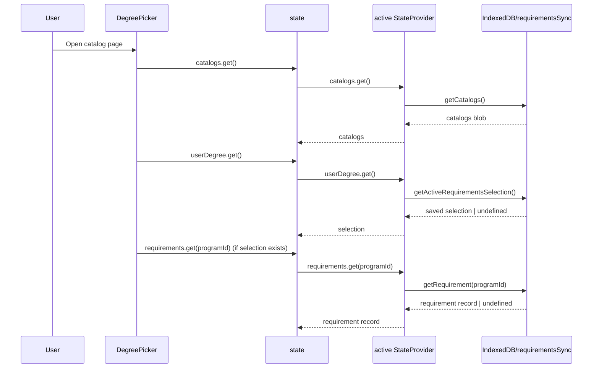

### Degree Selection Update (choose program/path)

User action: user chooses a catalog/faculty/program/path and applies it.

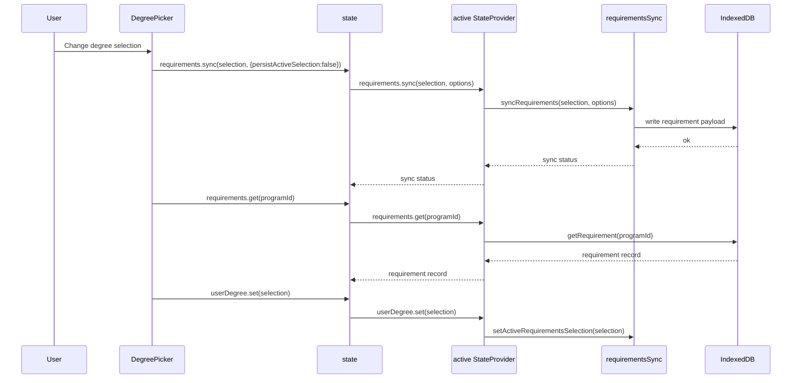

### Catalog Groups (view requirement table)

User action: user opens catalog page and expands requirement groups for the
currently selected degree.

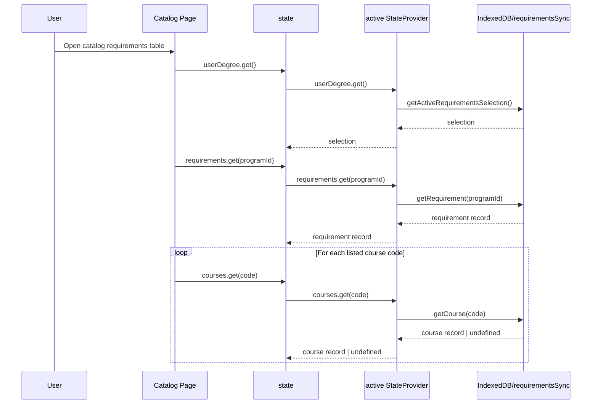

### Search Courses (search page interactions)

User action: user opens search page, filters courses, and runs queries.

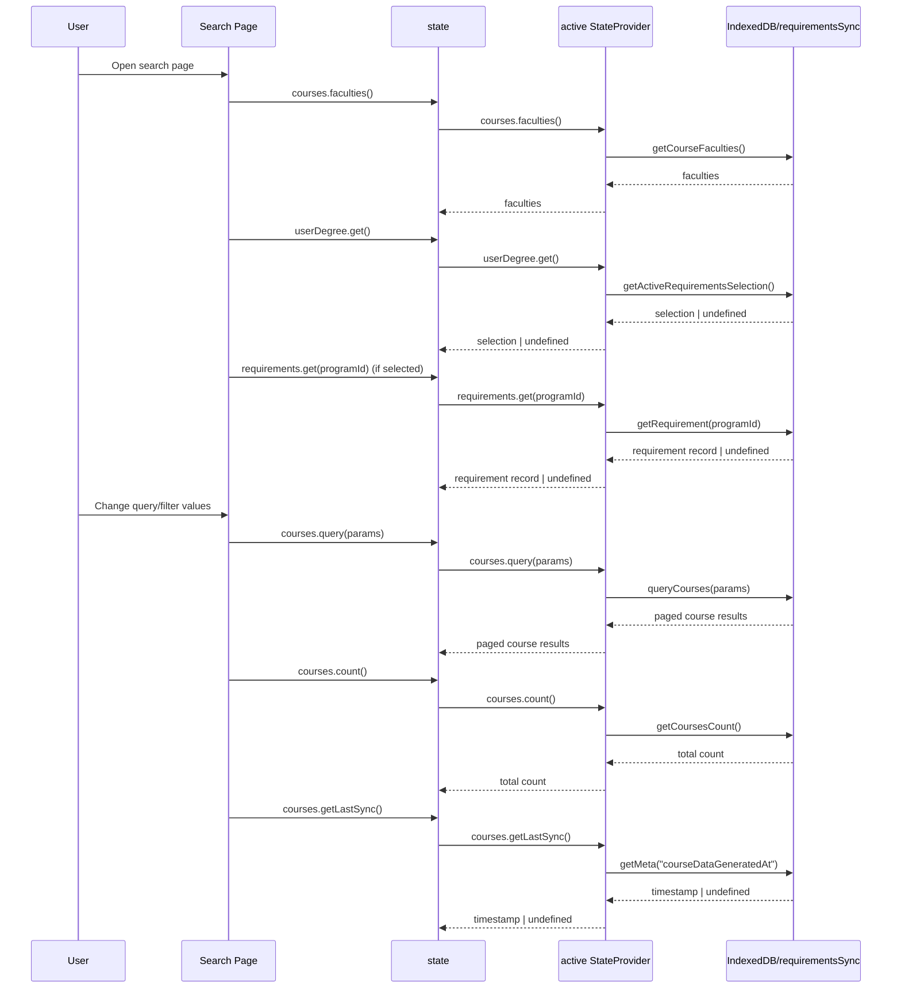

### Semester Page Row-Scoped Hydration

User action: user opens semester page and inspects semester requirements.

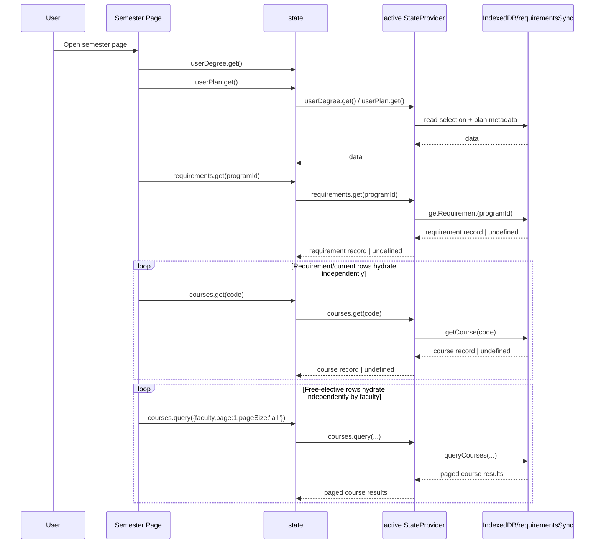

### Semester Course Selection + Add To Current Semester Persist

User action: user selects a course on semester page, clicks the current semester
panel to add it, and the plan metadata is persisted.

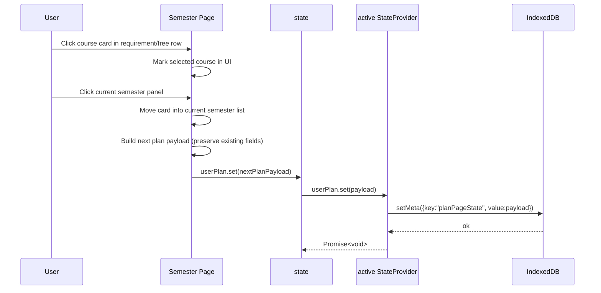

### Plan Page Load + Drag/Move Persist

User action: user opens planner, moves courses between semesters, then state is
persisted.

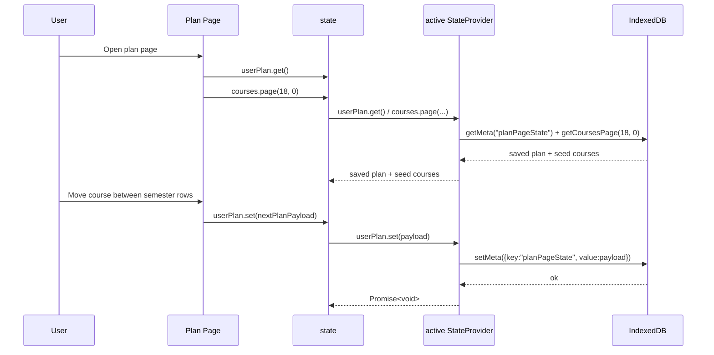

### Course Page Load + Related Courses

User action: user opens `/course?code=...` and the page hydrates the main course,
connections, and dependants from local data.

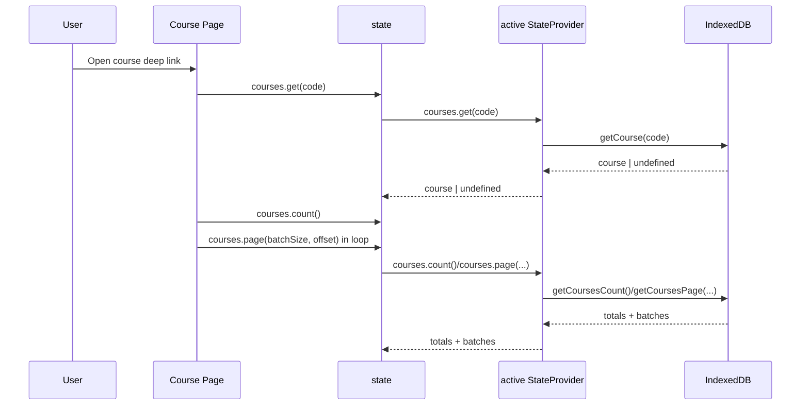

### Course Wishlist Add Persist

User action: user clicks "add to wishlist" on course page; the plan payload is
updated through state and persisted locally.

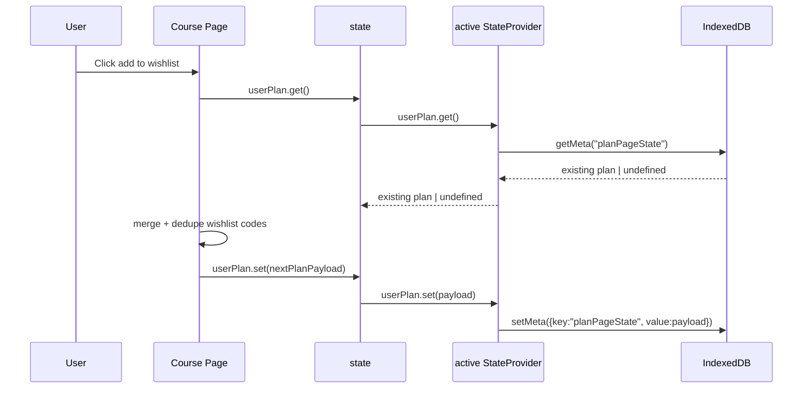

### Provider Swap + Router Rerender (test/dev flow)

User action: developer/test harness swaps provider implementation.

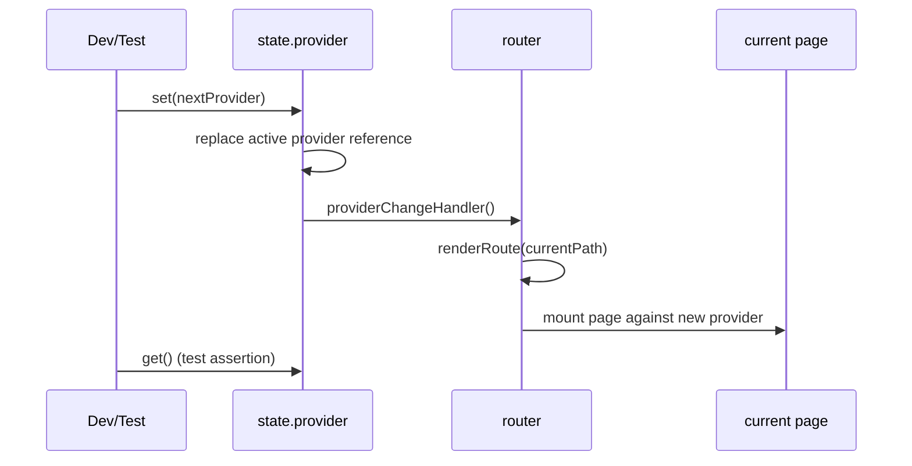

### Planned Data Sync Import (currently unused methods)

User action: user launches app while online and sync manager imports fresh JSON
into local DB (target flow; not currently wired to provider API).

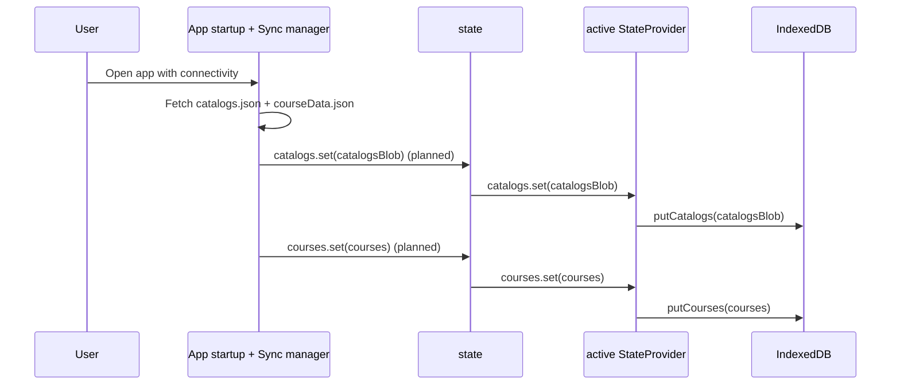

Unused today:

- `state.courses.set(...)` has no call site in `src/**/*.ts`.
- `state.catalogs.set(...)` has no call site in `src/**/*.ts`.

## Conventions and Pitfalls

- Always use `state` from pages; do not bypass into `indexeddb.ts` from page
  code.
- Keep provider methods Promise-based, even for immediate values.
- Story/test providers should return `Promise.resolve(...)` for sync data to
  avoid lints about async-without-await.
- Avoid relying on object identity of provider internals; treat provider as
  opaque.
- Provider swap rerenders current route; page-local transient UI state may be
  lost, which is currently expected behavior.

## Testing Guidance

- Unit tests can swap provider per test:
    - `state.provider.set(mockProvider)`
- Router tests should verify rerender on provider swap.
- Provider mapping tests belong in `src/lib/stateManagement.test.ts`.

## Dependencies

- `src/lib/indexeddb.ts`
- `src/lib/requirementsSync.ts`
- `src/lib/router.ts` (consumer of provider-change hook)

## Tests

- `proxies local provider course and degree getters`: validates local provider
  wiring to IndexedDB/requirements sync.
- `swaps provider and notifies rerender handler`: validates provider replacement
  and rerender callback.
- `loads user degree and plan from firestore when authenticated`: validates
  Firestore read-through into IndexedDB-backed slices.
- `saves user degree and plan to firestore when authenticated`: validates
  dual-write behavior (local + Firestore) for signed-in users.
