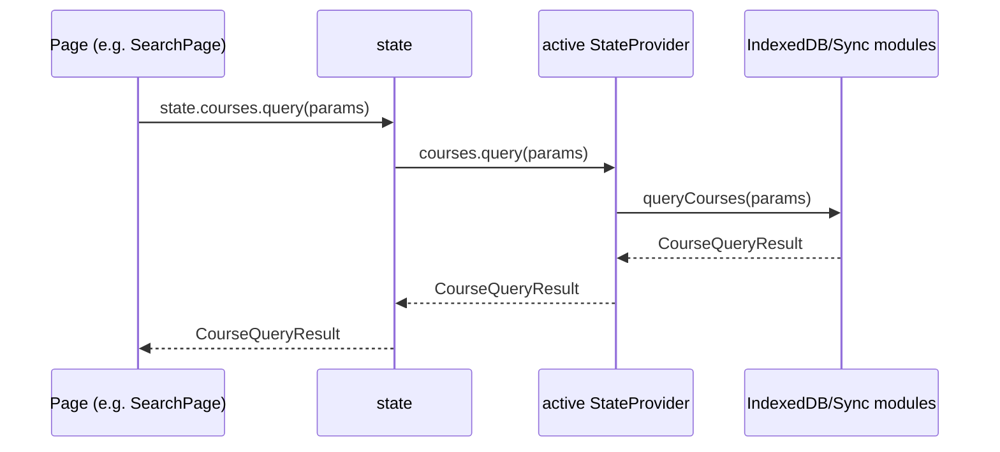
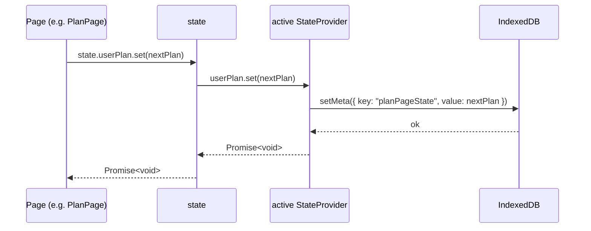
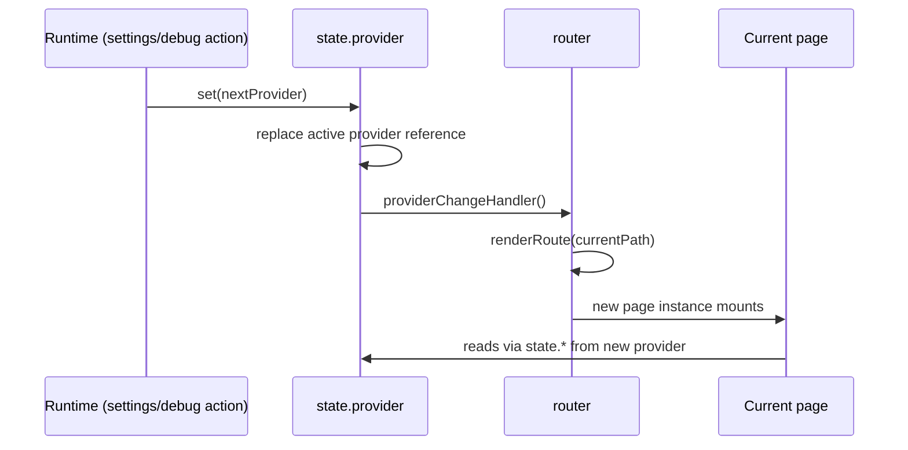
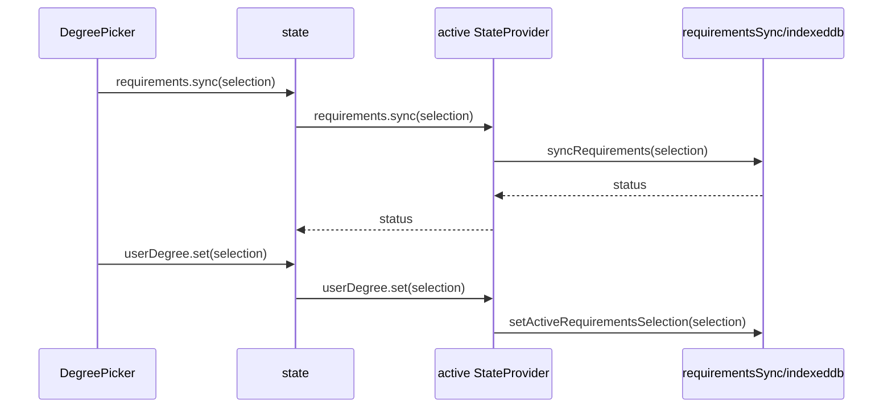
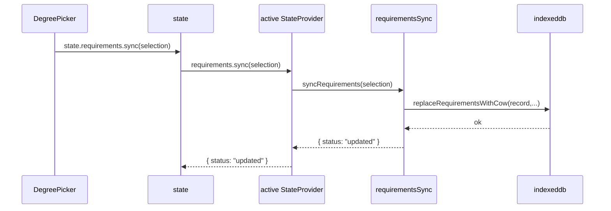
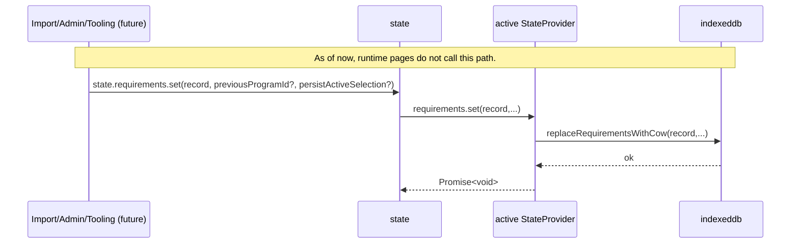

# stateManagement

## Overview

This module is the single state access boundary for app pages. Pages should not
call IndexedDB or requirements-sync modules directly. They should import
`state` and use domain methods (`state.courses.*`, `state.userPlan.*`, etc.).

The implementation is provider-based:

- The app has one active provider at a time (`local` now, `cloud` later).
- Every state operation delegates to the active provider.
- Swapping provider via `state.provider.set(nextProvider)` triggers router
  rerender of the current route, so the same page can rehydrate from the new
  backend without changing page code.

This file should be treated as a context dump for future work on state.

## Current Architecture (Context Switch Notes)

- Runtime pages use global `state`; constructor DI was intentionally removed.
- Provider change notifications are internal only (`setStateProviderChangeHandler`).
- There is no public `onchange` event API yet.
- `set(...)` methods are allowed to be async and should be treated as
  write-through operations for persistent slices.
- Router wires provider changes to rerender (`src/lib/router.ts`).

## Exports

- `state`
    - `state.courses.get(code)`
    - `state.courses.set(courses)`
    - `state.courses.query(params)`
    - `state.courses.page(limit, offset)`
    - `state.courses.count()`
    - `state.courses.faculties()`
    - `state.courses.getLastSync()`
    - `state.catalogs.get()`
    - `state.catalogs.set(catalogs)`
    - `state.requirements.get(programId)`
    - `state.requirements.set(record, previousProgramId?, persistActiveSelection?)`
    - `state.requirements.sync(selection, options?)`
    - `state.userDegree.get()`
    - `state.userDegree.set(selection)`
    - `state.userPlan.get()`
    - `state.userPlan.set(value)`
    - `state.provider.get()`
    - `state.provider.set(nextProvider)`
- `createLocalStateProvider()`
- `setStateProviderChangeHandler(handler)`
- `StateProvider` type

## Provider Contract

`StateProvider` is the stable contract for backend implementations.

- `courses`: course reads/writes and search-oriented queries.
- `catalogs`: catalogs blob read/write.
- `requirements`: requirement record read/write/sync.
- `userDegree`: active degree selection persistence.
- `userPlan`: planner state persistence (`planPageState`).

If you add a new slice, update all of these:

1. `StateProvider` type in `src/lib/stateManagement.ts`.
2. `state` delegating wrapper in `src/lib/stateManagement.ts`.
3. `createLocalStateProvider()` implementation.
4. Tests in `src/lib/stateManagement.test.ts`.
5. Story/test helpers that construct providers in pages.
6. This document.

## Local Provider Mapping

Current local provider methods map to existing modules as follows:

- `courses.get` -> `indexeddb.getCourse`
- `courses.set` -> `indexeddb.putCourses`
- `courses.query` -> `indexeddb.queryCourses`
- `courses.page` -> `indexeddb.getCoursesPage`
- `courses.count` -> `indexeddb.getCoursesCount`
- `courses.faculties` -> `indexeddb.getCourseFaculties`
- `courses.getLastSync` -> `indexeddb.getMeta('courseDataLastSync')`
- `catalogs.get` -> `indexeddb.getCatalogs`
- `catalogs.set` -> `indexeddb.putCatalogs`
- `requirements.get` -> `indexeddb.getRequirement`
- `requirements.set` -> `indexeddb.replaceRequirementsWithCow`
- `requirements.sync` -> `requirementsSync.syncRequirements`
- `userDegree.get` -> `requirementsSync.getActiveRequirementsSelection`
- `userDegree.set` -> `requirementsSync.setActiveRequirementsSelection`
- `userPlan.get` -> `indexeddb.getMeta('planPageState')`
- `userPlan.set` -> `indexeddb.setMeta({ key: 'planPageState', ... })`

## Sequence Diagrams

### Read Path (Page -> State -> Active Provider)

### Write Path (Page -> State -> Persist)

### Provider Swap + Rerender

### Degree Selection Update

### Requirements Sync Write (Used in App Flow)

### Direct Requirements Set (Currently Not Used by Runtime Pages)

## Conventions and Pitfalls

- Always use `state` from pages; do not bypass into `indexeddb.ts` from page
  code.
- Keep provider methods Promise-based, even for immediate values.
- Story/test providers should return `Promise.resolve(...)` for sync data to
  avoid lints about async-without-await.
- `state.requirements.set(...)` is a direct persistence API and is currently not
  used by runtime page flows; runtime updates use `state.requirements.sync(...)`.
- Avoid relying on object identity of provider internals; treat provider as
  opaque.
- Provider swap rerenders current route; page-local transient UI state may be
  lost, which is currently expected behavior.

## Testing Guidance

- Unit tests can swap provider per test:
    - `await state.provider.set(mockProvider)`
- Router tests should verify rerender on provider swap.
- Provider mapping tests belong in `src/lib/stateManagement.test.ts`.

## Dependencies

- `src/lib/indexeddb.ts`
- `src/lib/requirementsSync.ts`
- `src/lib/router.ts` (consumer of provider-change hook)

## Tests

- `proxies local provider course and degree getters`: validates local provider
  wiring to IndexedDB/requirements sync.
- `swaps provider and notifies rerender handler`: validates provider replacement
  and rerender callback.
